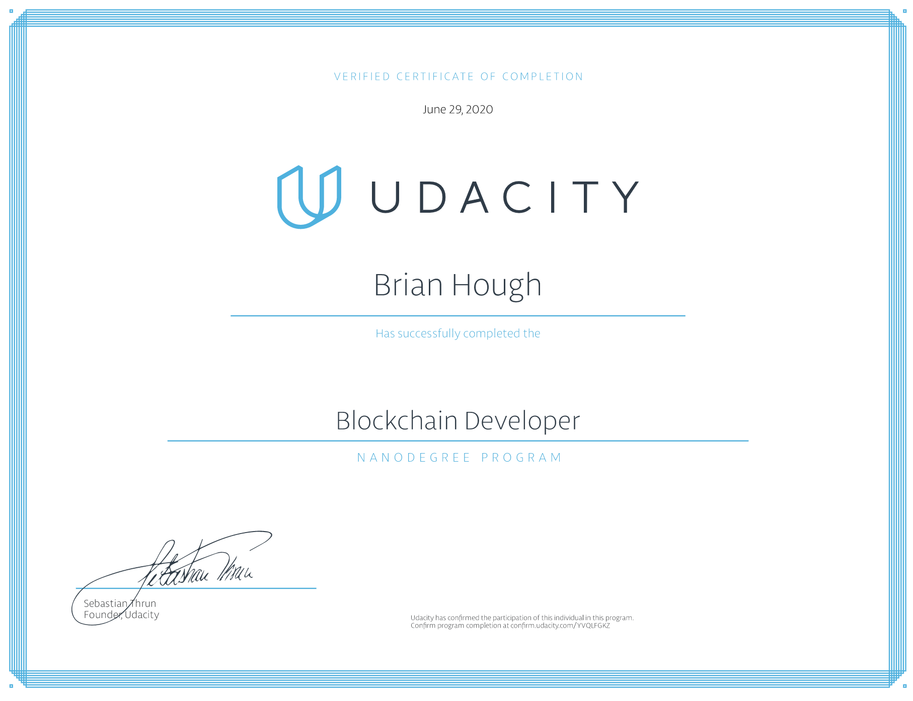

## Verification Link:

https://graduation.udacity.com/confirm/YVQLFGKZ

## Program Description

Learn the fundamentals of the blockchain platform. Create your own private blockchain, and secure a digital asset using blockchain identity. Explore the Ethereum platform, and use Solidity and smart contracts to develop your own decentralized app.

## Program Details

### Blockchain Fundamentals

Learn the basics of how the blockchain data model works by creating your own private blockchain using Node.js and Leveldb.

### CREATE YOUR OWN PRIVATE BLOCKCHAIN

Ethereum Smart Contracts, Tokens and Dapps
Advance your blockchain skillset to the second generation of blockchain services with smart contracts utilizing the Ethereum network.

### BUILD CRYPTOSTAR DAPP ON ETHEREUM

Blockchain Architecture
Learn blockchain architecture and advanced concepts such as privacy, security and decentralized file management.

### ETHEREUM DAPP FOR TRACKING ITEMS THROUGH SUPPLY CHAIN

Dapp with autonomous smart contracts and oracles
Advance your blockchain skill set by developing a decentralized application (Dapp) that will perform actions based on external triggers, and handle payments.

### FLIGHT DELAY INSURANCE DAPP

Dapp with autonomous smart contracts and oracles
Advance your blockchain skill set by developing a decentralized application (Dapp) that will perform actions for a system that provides flight insurance.

### Capstone

For your capstone project, you’ll use all the new skills you’ve acquired to build decentralized property listing application.
